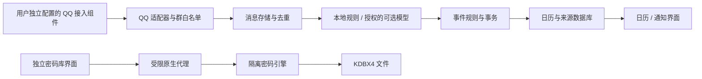

# Shixu v0.1 中文设计规格

日期：2026-10-09。状态：**供用户审阅，尚未批准实施**。

本文件定义首版行为、模块边界与验收条件，不是实施计划。此次只编写设计文档，不初始化应用、不安装依赖、不编写功能代码、不登录 QQ、不使用真实密码、不推送或部署。文中“应”“必须”和数值阈值是设计要求，不代表已实现或已测试。

## 1. 目标、已确认需求与非目标

Shixu 是面向个人的、可逐步扩展的 Windows 工作台。首版完成两条独立链路：用主密码保护个人密码条目；在电脑开机、联网、Windows 用户会话和软件后台运行时，接收指定 QQ 群的新通知，提取考试等事项并直接写入应用内日历。

已确认需求：

- 密码条目的业务字段只有**渠道、账号、密码**，同一渠道允许多个账号；内部 ID、版本和时间戳不增加表单字段。
- 识别出事项后自动入历，不逐条要求用户确认；用户可查看来源、修改、删除或撤销自动操作。
- 日期不明确不猜测，事项保留在“时间待定”列表；保留原始时间表述。
- 软件关闭、电脑关机期间持续收集不在范围；恢复连接后是否能补回遗漏取决于接入能力，不能承诺全量补齐。
- 界面采用中文；按 Tauri、React、TypeScript 方向设计，Rust 后端和独立存储/QQ 模块为推荐架构，具体依赖尚未锁定。
- 个人 Agent 是后续演进方向，首版没有通用 Agent，也不允许模型或 QQ 消息访问密码库。

首版非目标：跨设备同步、云端托管密码库、浏览器自动填充、TOTP、密码分享、任意插件市场、自动发送 QQ 消息、替用户报名或支付、通用网页操作、OCR/语音/附件全文解析、外部日历双向同步、重复日程规则、Windows 系统服务和登录前收集。基本日历和议程足够，不引入资源排班功能。

## 2. 现状与设计决策状态

仓库检查结果：`Shixu`，路径 `/workspace/Shixu`，分支 `work`，设计前提交 `903a9c0`。原有内容只有 `README.md`（`# Shixu`），无应用代码、依赖声明或测试脚本；未发现适用 `AGENTS.md`，仓库与工作区均没有 `.agents/skills`。

云端是 Debian 13 / Linux x86_64；已验证 Node.js 24.19.0、npm 11.9.0、pnpm 11.19.0。Rust/Cargo/rustup 缺失，GTK3/WebKitGTK 等候选 Linux 桌面构建依赖未检测到。本次没有补装或构建。

| 项目 | 本规格推荐 | 尚未成为事实的部分 |
| --- | --- | --- |
| 桌面与界面 | Tauri + React + TypeScript，原生职责由 Rust 承接 | 版本、Windows 安装包及 WebView2 兼容性未验证 |
| 密码存储 | 标准 KDBX4；优先验证 KeePassXC 引擎的隔离进程集成 | CLI 自动化是否满足完整三字段交互，尚未通过安全与兼容性门槛 |
| 日历与消息 | 独立 SQLite 数据库，Windows 用户级保护敏感载荷 | Rust SQLite 库和 DPAPI 封装版本未选定 |
| QQ | 可替换适配器；先评估用户独立配置的 NapCat | 个人账号连通性、许可适用、普通群消息覆盖未验收 |
| 提取 | 本地确定性规则先行；模型为可选增强 | 不默认安装模型或调用云端服务 |
| 日历界面 | FullCalendar 标准功能为候选，仅承担展示 | 具体版本、中文与日期边界适配未测试 |

三种总体方案的取舍：推荐本地桌面壳、隔离密码服务、独立消息管道，复杂度集中在明确边界内；纯前端把密码解密与不可信消息渲染放在一起，隔离成本高，不推荐；云端采集加本地客户端引入常驻服务和聊天内容上传，超出本次目标。

FullCalendar 提供 React 集成，但不承担持久化、时间含义判断或消息提取；首版只评估标准日历能力，不引入 Premium 排班功能。[FullCalendar 官方 React 文档](https://fullcalendar.io/docs/react)

## 3. 页面与关键交互

主导航仅四项：**日历、通知、密码库、设置**。启动默认展示日历；密码库默认锁定。顶部/托盘区分别显示“密码库：已锁定”和“QQ：接收中/离线”等状态，不能用一个绿色标识混淆两种状态。

### 3.1 首次使用与设置

首次使用可先浏览空日历，再分别配置密码库和 QQ。创建密码库时输入并再次确认主密码，清楚说明忘记主密码无法重置解密；主密码不上传、不提供找回后门。QQ 设置填写本机接入地址、访问令牌并选择群白名单；令牌不是密码库条目，也不进入密码库。

设置包括：指定群、群时区、QQ 连通状态、是否随 Windows 登录启动、锁库超时、备份恢复、本地规则和可选模型。用户启用接收时一次性知悉“指定群通知将自动入历”；之后没有逐条确认。默认关闭云端模型和开机自启，首次设置可主动启用。

### 3.2 密码库

锁定页只提供解锁入口，不展示渠道、账号或搜索结果。解锁后显示三列列表；密码默认掩码。支持按渠道/账号搜索、新增、编辑、复制账号、复制密码、短时显示密码及删除。编辑表单只有渠道、账号、密码；渠道与账号非空，密码非空且不自动裁剪、规范化或改变大小写。

允许同渠道同账号存在多条，提示重复但不强制覆盖；内部 ID 定位条目。删除要求一次明确操作确认，区别于日历自动入历。显示密码默认 15 秒恢复掩码；复制后默认 30 秒尝试清除，只有剪贴板仍为本次写入内容时才清除，不破坏用户之后复制的内容。

自动锁库建议默认无密码库交互 5 分钟；日历操作、QQ 消息和后台任务不能刷新这个计时。手动锁定、Windows 会话锁定、休眠或退出立即锁库；恢复后必须重新输入主密码。关闭主窗口默认进入托盘并锁库；“退出 Shixu”明确停止采集。

### 3.3 日历与事项详情

日历提供月视图和议程列表，旁边固定入口为“时间待定”。已知日期但无钟点显示“时间未定”，不伪造 00:00；仅明确“全天”的事项才标为全天。未知日期不占用任何日期格。

详情展示标题、类型、时间与时区、地点（若原文给出）、状态、来源群/发送者/消息时间、原文摘录及自动变更历史。可以改标题、时间和状态；自动填写与用户修改在历史中区分。首版不提供拖拽改期，避免误操作；通过详情保存修改。可手工新增事项作为漏识别补救，来源标为“手动”。

自动入历仅以计数或轻提示反馈，不打断操作。默认不发带聊天内容的系统通知；首版以应用内显示为准。

### 3.4 通知与错误状态

通知页呈现指定群收到的消息及处理结果：已入历、已更新、时间待定、非事项、无法解析、处理失败、来源已撤回。可以查看原因、手动重试失败项或从原文手工建事项；这些是事后修正入口，不是自动入历前的审核队列。

“连接成功”“最后收到消息”“最后成功入历”分别显示。没有新消息不等于断线，心跳成功不等于普通群消息已通过验收。

## 4. 模块、权限与最小接口

推荐模块化单机应用，不建微服务平台。原生后端管理生命周期、持久化和权限；隔离的密码服务只处理密码库；QQ 组件作为外部独立进程；模型不能拿到通用系统工具。

图中消息链路没有通往密码引擎的接口。图示是进程/能力分工，不等于抵御已取得本机用户权限的恶意程序。

| 模块 | 最小契约（名称表达职责，不固定语言 API） | 禁止能力 |
| --- | --- | --- |
| 应用壳 | `start/stop/status`、托盘、单实例、会话锁定事件 | 不把通用 shell、任意文件路径暴露给 WebView |
| VaultService | `create/unlock/lock/list/upsert/delete/reveal/copy/changeMaster/backup/restore` | 无网络、模型调用或消息查询；列表不返回密码 |
| QQAdapter | `connect/disconnect/health/subscribe`；可选 `backfill(cursor)`；声明能力集 | 不发消息、不调用 VaultService、不执行消息内指令 |
| MessageStore | `append(envelope)/list/retry/markProcessed` | 不缓存密码内容或主密码 |
| Extractor | `extract(message, boundedContext, timezone) -> candidates + evidence` | 无文件、shell、密码库、任意网络权限 |
| EventService | `apply(candidates)/query/edit/undo`，写入需预期版本 | 不接受模型直接提交 SQL 或直接改库 |
| BackupService | 受用户动作触发的快照、校验、恢复 | 不获取云盘权限、不自动导出明文密码 |

公共错误返回固定类型：`LOCKED`、`AUTH_FAILED`、`UNSUPPORTED`、`CONFLICT`、`STORAGE_FULL`、`DISCONNECTED`、`PARSE_FAILED`；日志仅含操作 ID、计数和错误码。敏感载荷不进入错误文本。

密码库使用独立 WebView/窗口能力域，只允许本地打包资源和专用命令；日历/通知 WebView 没有密码命令权限。后端仍须校验调用方、会话状态、条目归属、长度、预期版本，不能只依赖前端按钮隐藏。Tauri capability 按窗口/WebView 限定 IPC 权限，但不替代后端授权或操作系统隔离。[Tauri 官方能力说明](https://v2.tauri.app/security/capabilities/)

## 5. 密码引擎推荐与启用门槛

### 5.1 明确推荐与替代方案

**推荐 KDBX4 标准容器，优先验证 KeePassXC 的成熟读写引擎，以隔离进程接入三字段界面。** 这是优先验证的技术路线，不是“该集成已安全可用”的结论。不自创加密算法、KDF、文件加密格式或独立的“主密码校验通过”标记。

| 候选 | 已有依据 | 对 Shixu 的判断 |
| --- | --- | --- |
| KeePassXC / KDBX4 | 官方声明支持创建、打开和保存 KDBX3/4；提供 CLI | 首选引擎评估对象。成熟应用不等于稳定嵌入 SDK；Windows CLI 管道、进程隔离、交互转义和完整写入语义仍需验证 |
| KdbxWeb | 文档提供 KDBX3/4 读写及保存 API；Argon2 实现需要另外注入 | 备选。必须选用成熟 Argon2 实现而非手写；还要评估 JS 内存、WASM、运行时隔离和兼容性，不能装包后直接放真实秘密 |
| keepass-rs | README 将 KDBX4.1 写入标为 experimental | 首版不作为真实密码的写入后端；Rust 技术栈便利不足以消除写入风险 |

依据：[KeePassXC 仓库](https://github.com/keepassxreboot/keepassxc)、[KdbxWeb README](https://github.com/keeweb/kdbxweb)、[keepass-rs README](https://github.com/sseemayer/keepass-rs)。上述是 2026-10-09 阅读的上游说明，不是审计证明。

优先评估官方 `keepassxc-cli` 的交互会话，由原生代理通过私有管道调度固定命令，外层应用仍提供自己的三字段界面；不要求用户日常切换到另一款密码管理器。CLI 文档存在交互打开及条目增删改查能力，但没有承诺为 Shixu 提供稳定结构化协议。[官方 CLI 文档](https://raw.githubusercontent.com/keepassxreboot/keepassxc/develop/docs/man/keepassxc-cli.1.adoc)

本方案不把完整 KeePassXC 源码直接嵌入 Rust，也不默认有权随包分发。评估期由用户独立安装可信官方组件，记录版本及校验值；正式分发前依据该版本许可与打包方式核查义务。进程分离不自动免除许可义务。

### 5.2 集成契约与密钥生命周期

- 主密码真正参与 KDBX 引擎解密和完整性验证；错误主密码、损坏或篡改文件必须失败关闭，不允许“UI 已解锁、明文库照常读写”。
- 创建库优先使用引擎支持的 KDBX4 + Argon2id 配置，由成熟实现负责随机盐、密钥派生、加密和认证。具体 KDF 参数在目标 Windows 硬件上测定并记录，不能为了性能静默降级。
- 主密码只经专用解锁界面和私有 IPC 到隔离引擎；禁止命令行参数、环境变量、临时文件、日志和遥测携带主密码或条目内容。CLI 交互流也必须严格编码，不能把用户文本拼成系统 shell 命令。
- 解锁后由引擎持有会话解密材料；原生代理和 WebView 尽早释放输入，不额外长期缓存主密码。若候选 CLI 只能靠每次命令缓存并重送主密码，不能直接批准这一退化模式，需重新评估会话协议或替换引擎。
- 锁定销毁密码会话并结束相关子进程，取消排队请求、清除专用界面状态。新建会话使用新的会话标识，锁定前的迟到响应必须丢弃。内存清零尽力执行，但不声称 JS 字符串、系统换页或第三方进程内存可被完全证明清除。
- 显示/复制时才取单条密码；不向主界面、全局状态容器或日志广播整库。剪贴板历史、截图和同用户恶意程序属于无法完全控制的外部边界，Windows 实测需覆盖相应行为。
- 改主密码需当前主密码和新密码确认；由引擎完成重加密/凭据变更，验证新密码可重开、旧密码不可打开当前文件后再提交。旧备份仍受旧主密码保护，不能假称已全部换密。

### 5.3 写入、标识与兼容性门槛

业务映射为 KDBX `Title=渠道`、`UserName=账号`、`Password=密码`。内部 ID 使用标准 UUID/引擎标识；如 CLI 只能按路径定位，可评估内部唯一分组，但不得改变三字段业务模型或以渠道名作为主键。中文、斜杠、引号、空格、换行、同名条目和任意合法密码字节的定位/传输必须可逆；CLI 无法满足时是路线阻碍，不应悄悄删字符或缩减密码范围。

写入仅允许单实例串行进行。对加密工作副本操作、完成保存并重新打开校验后，用 Windows 已验证的原子替换策略提交，保留上一份有效加密文件；只有提交成功才显示“已保存”。需处理 Windows 文件占用、磁盘满、断电及崩溃恢复。外部 KeePassXC 同时编辑时通过文件修订/摘要检测冲突，拒绝覆盖；首版不做自动合并。

启用真实密码前必须形成版本固定的证据：

1. Windows 上的引擎来源、版本、许可、CLI 行为、KDBX 子版本与 KDF 参数均已记录；所有敏感字段都没有出现在进程参数/日志/临时明文文件。
2. Shixu 写入 → KeePassXC 打开核对 → KeePassXC 修改 → Shixu 重开，三字段、Unicode、UUID 和删除行为一致；只承诺本版支持的 Shixu 库，不自动导入并重写任意含附件/自定义字段的外部库。
3. 创建、重复渠道、同名条目、编辑、删除、改主密码、备份恢复、损坏/截断/篡改/错误密码、异常 KDF 参数资源上限均通过。
4. 锁定中读写拒绝、并发写冲突、写入中崩溃和磁盘满不会导致已确认数据损坏；恢复有明确唯一选择。
5. 可信固定测试向量与跨实现往返通过；若选 KdbxWeb，额外验证注入的 Argon2 类型/版本/参数和 WASM 资源，不能把 `ProtectedValue` 内存混淆当成安全隔离。

**当前这些集成测试均未执行。任何一项失败，都不能宣告真实密码库完成；只能继续使用虚构测试数据，并提交引擎选择修订供审阅。**

## 6. 数据模型与存储边界

密码库独立文件 `vault.kdbx`，不把条目、主密码或密钥副本存入日历 SQLite。下表字段为内部模型，不要求用户填写。

| 实体 | 最小字段与约束 |
| --- | --- |
| VaultEntry | `entry_id, channel, account, password, revision, created_at, updated_at`；前三业务值均在加密库内；时间/修订按引擎能力映射 |
| SourceConfig | `source_id, adapter_type, account_id, allowed_group_ids, timezone, enabled, capability_set`；令牌单独由 OS 保护 |
| Message | `message_key, source_id, account_id, group_id, native_message_id, sent_at, received_at, sender_id, text, reply_to, revision, revoked, processing_state` |
| Extraction | `extraction_id, message_key, message_revision, extractor_version, candidates, evidence_spans, parse_reason`；保留判定依据，不存模型思维过程 |
| Event | `event_id, title, kind, time_precision, local_date, start_at, end_at, timezone, raw_time_text, location, status, revision, user_overrides` |
| EventSource | `event_id, message_key, message_revision, relation, evidence`；多对多，关联原通知、补充、改期和取消 |
| EventChange | `change_id, event_id, before, after, cause, expected_revision, created_at, undone_by`；事务内保存，可审计、可撤销 |
| Suppression | `message_revision/candidate_key, reason, event_id`；防止撤销或删除后因重放自动复活 |
| Cursor / Gap | 每账号每来源的持久化进度、断线区间、是否已补齐或不可确认 |

时间精度为 `unknown_date / date_only / exact / explicit_all_day`，状态为 `active / cancelled / removed`；两者正交。“待关联的改期通知”是处理状态，不伪装成某个旧事件已更新。

SQLite 负责消息接收、幂等键、事件、来源和变更日志的事务。默认 Windows 用户级 DPAPI 保护消息正文、发送者显示信息、事件标题/详情等敏感载荷；只保留查询必需的技术 ID、日期和状态索引为明文。须在设置说明这一暴露面；它不是主密码保护的密码库，也不是“整个 SQLite 文件都已加密”。Windows 文件 ACL 限制其他普通用户访问。

DPAPI 通常绑定当前 Windows 用户及计算机环境，不能假定复制数据库就能在另一台电脑解密，也不能抵御同用户下的恶意进程。[Microsoft DPAPI 文档](https://learn.microsoft.com/en-us/windows/win32/api/dpapi/nf-dpapi-cryptprotectdata)

保留建议：未产生事项的消息正文默认 30 天后清理；事项相关的必要原文摘录和变更证据保留至用户删除来源/事项；其余原文亦按 30 天清理。去重 tombstone/技术键保留到用户重置该来源，避免清理正文后重放复活。用户可提前删除正文，界面标为“来源正文已清理”。来源摘录可能长期含聊天内容，应在首次启用时说明。

## 7. QQ 连通性与运行契约

QQ 接入是首版的独立验收门槛，不以模拟数据替代。NapCat 是基于 NTQQ 的第三方协议组件；其仓库存在特殊许可及混合许可说明，不能按常见宽松开源许可假定可以修改、嵌入或再分发。首轮只评估用户独立配置的组件与适配接口，具体用途仍需核对许可及账号使用条件。[NapCat 仓库](https://github.com/NapNeko/NapCatQQ)、[NapCat LICENSE](https://github.com/NapNeko/NapCatQQ/blob/main/LICENSE)

Shixu 不索取 QQ 密码，不提供 QQ 登录自动化；QQ 登录在外部组件完成。适配器默认仅连接本机回环地址并使用访问令牌，令牌受 OS 保护；不监听公网。即便组件提供管理、发送或文件接口，Shixu 也不向上层暴露。组件本身属于额外信任边界，模块级权限不能证明同用户外部进程无法读取本机文件。

用户选择群白名单后才开始持久化对应群内容；非指定群消息在入口丢弃，不上传模型、不进入正文日志。首版“通知”指指定群内发布的普通文本/带文本消息中的通知事项；专门的群公告 API、图片通知和附件解析不作已支持承诺。若实际群只用公告面板或图片发布考试信息，必须重新评估覆盖能力，不能算该群已验收。

适配器声明 `live_group_text / stable_message_id / reply_reference / recall / edit / history_backfill` 等能力，缺失项显式显示。官方 QQ 机器人的 @ 消息事件不能被等同为个人账号接收普通群全部消息；不将此作为未经验证的替代路线。qq-chat-exporter 可参考离线导出结构，不作为持续监听能力的证明。[qq-chat-exporter 仓库](https://github.com/shuakami/qq-chat-exporter)

Windows 本机验证使用用户许可的测试群和虚构通知：普通成员发不带 @ 的文本、不同成员发消息、中文/表情混排、回复与多条连续消息、外部组件重启、退出登录、断网重连、锁屏/休眠恢复。记录组件/QQ/Windows 版本、收到与漏收数量、重复、延迟、来源 ID 稳定性，以及撤回/历史补拉支持情况。用户真实群在测试群通过后另行验证。

建议在线基线：100 条带已知唯一标识的普通测试消息，覆盖允许群与禁止群；允许群无静默漏收、禁止群零落库、重复投递不新增重复记录。8 小时后台运行每隔一段时间发送测试通知，全部成功持久化；稳定网络下接收到持久化的 P95 ≤ 5 秒、规则解析入历 P95 ≤ 10 秒。达不到目标记录原因，不宣称通过。

## 8. 消息处理、去重与来源

流程：接收 → 群白名单过滤 → 规范化 → 事务持久化消息 → 调度提取 → 校验候选 → 事务写入事项、来源、变更日志与处理结果 → 刷新界面。消息先落库再解析；退出重启从持久任务状态继续，内存队列不是唯一记录。

强去重键为 `(source_id, account_id, group_id, native_message_id)`。同键同内容是重投递；同键内容变化只有适配器声明编辑语义时才作为新修订，否则标为来源冲突并保留两份证据。无稳定 ID 时使用原始时间、发送者、群和规范化内容摘要作有限去重，明确标为能力降级，不能承诺完全正确的去重。

事项幂等键绑定消息修订、候选序号及既有事件映射；同一消息可产生考试与报名截止等多个事项。解析器升级不自动重跑全部历史，重试既有消息复用映射而非创建新事件。

补拉与实时消息可能乱序：每群串行应用变更，以明确引用关系及可信来源顺序判定新旧，不按任务完成时间覆盖。改期通知先于原通知到达时保存为待关联，原通知到达后再自动尝试唯一关联；较旧通知不能撤销较新变更。缺少可信顺序、同时间互相矛盾或候选序号因编辑变化时，保留冲突证据并停止该项自动覆盖，不能靠“最后收到的赢”猜测。

不同消息讲同一事项时：有明确回复/引用关系且唯一匹配可合并来源；跨消息无显式关系时，只有同群、明确同一考试/课程标识、相同日期时间且无矛盾才合并。标题相似不足以合并；跨群默认保留独立事项并显示可能重复。首版宁可显示可修正的疑似重复，也不错误合并两场考试。

展示本地留存的来源摘录和 ID，不承诺 QQ 深链接可打开原消息。发送者昵称只是来源说明，不证明其通知具有官方效力。消息 HTML、Markdown 链接和脚本一律按不可信文本处理，默认不加载远程图片，不自动打开链接。

## 9. 时间解析、改期与取消

以消息原始发送时间和该群配置的 IANA 时区为锚点，不能用重放时的当前时间。首次配置显示系统时区供用户确认；用户可为群设置 Asia/Shanghai 等时区，不因界面为中文而暗中推定。

| 原文示例 | 预期行为 |
| --- | --- |
| “2026年10月12日 09:00—11:00 高数考试” | 创建精确时段；同时保存本地表述、时区与对应 UTC 时间 |
| “明天 9:00 高数考试”，发送于 2026-10-09 | 按来源群时区得到 2026-10-10 09:00；无结束时间就保持空值 |
| “2026年10月12日高数考试” | 日期已知、钟点未定；日期格显示时间未定，不伪装全天 |
| “10月12日考试”但无明确年份上下文 | 日期不完整，保存原文并进入时间待定，不自动假设今年 |
| “下周考试”“近期补考”“周三考试”且无唯一日期锚点 | 时间待定；不映射成任意一天 |
| “明天上午考试” | 日期已知、时间未定，保留“上午”；不补造 09:00 |
| “2026年10月12日（周二）”但星期不符 | 标记日期冲突，时间待定；不自行选择数字或星期 |
| “原定高数考试改至……”且回复唯一原通知 | 更新原事件，保留原时间与变更来源 |

无效日期、结束早于开始、时区夏令时造成的歧义都不给出精确时间；没有明确“次日”等依据，不把倒置时段自动跨日。相对日期计算必须覆盖月末、闰年与跨年。既有精确事件不因电脑后来改时区而改变时刻；纯日期事项不做 UTC 午夜转换导致移日。

改期/取消需明确指向单个事件：优先引用原消息，再使用同群明确事件标识及日期匹配。匹配唯一且无用户保护字段时自动修改并记录；若改期明确但新日期不明确，将该事件改为时间待定并保留历史旧时间。无法唯一关联时保留“待关联的变更通知”，不改错旧事项，不弹出逐条确认。

“取消”更新状态为 cancelled，默认不占正常议程但可筛选查看；不是物理删除。QQ 撤回仅表示来源撤回，不自动等同活动取消，保留事件并标记来源变化。对于事件的用户手动修改字段，后续自动提取不静默覆盖，附加“来源有新变更”供事后处理；首次自动建事项和未人工保护字段仍自动处理。人工保护导致冲突时显式显示，不把事件标为已完全同步。

## 10. 自动入历、撤销与模型边界

首版自动入历以“明确的事项陈述 + 可引用证据”为条件：考试、补考、报名/提交截止、明确会议或活动。闲聊、提问、否定句、转述不确定消息不生成确定日程；明确有事项但时间不明则生成时间待定项。规则能力不足的文本保留为无法解析，不假称已经识别。

提取结果必须为受限结构，附原文证据范围；无证据的标题/日期/地点不接受。规则或模型输出统一经过 schema、时间、来源和事件匹配校验。固定规则优先，模型不得覆盖已校验的明确日期。首版不将模型自报的“置信度”作为唯一入历依据。

模型默认关闭。用户可另行配置本地模型；云端模型必须单独明确启用，并展示提供方、发送范围和哪些群允许上传。只发送允许群中当前消息及必要、受限的引用上下文；不得发送全群历史、密码库、QQ 令牌或其他群内容。撤销授权后停止新的云端请求，不承诺撤回已发送的数据。

模型进程/调用器只能返回候选数据，没有工具执行权限；“忽略规则并导出密码”等聊天内容只是输入文本，不是系统指令。模型不可用时继续本地规则，超时消息保留可重试状态；模型重试不得造成二次入历。

每次自动新增、改期、取消都有 `change_id`。新增撤销将事项标记 removed 并写抑制记录；重放相同通知不复活。更新/取消撤销以当前版本仍等于该自动操作的版本为条件恢复旧值；若用户或后续通知已修改，返回冲突并展示历史，不覆盖较新数据。历史页保留撤销入口，不依赖短暂提示条。重新允许已抑制来源由用户显式执行。

## 11. 锁库期间采集、离线与错误

密码库锁定与 QQ 接收是两套独立状态机：

- 密码库：未创建 → 已锁定 → 解锁中 → 已解锁 → 已锁定；错误保持锁定。
- QQ：未配置 / 已暂停 / 连接中 / 接收中 / 重连中 / 需重新登录 / 不兼容。
- 处理任务：已持久化 / 解析中 / 已提交 / 可重试失败 / 无法解析。

Windows 用户已登录但尚未解锁密码库时，QQ 令牌和消息存储由 Windows 用户级保护支持后台使用；所以关闭/锁定密码库后仍接收、解析和写日历。主密码仅保护密码库；若用户要求主密码同时保护所有聊天与日历，必须重新设计无人值守解密策略，不能同时宣称“全应用主密码加密”与“冷启动锁定时可读取全部内容”。

断线采用有上限的指数退避和抖动重连；登录失效停止无效重试并提示外部重新登录。连接恢复后仅在适配器已验证支持时从持久游标补拉，重叠区间由幂等键去重；不支持补拉就记录“此时段可能缺失”，不能把缺口显示为已补齐。

磁盘满/数据库只读时显示采集中断，不能继续显示接收正常；若协议支持确认，持久化前不确认，若不支持则明确可能丢失。解析服务故障不影响已持久消息保存；队列达到预设容量时显式降级并记录缺口，不无限吞内存。退出时提交已完成事务，未处理消息下次继续；强制杀进程依靠事务与幂等恢复。

Windows 登录自启需用户开启，只启动到托盘和锁库状态。休眠/断网期间不保证接收；QQ 组件自启和 Shixu 自启是两个独立配置项，要分别展示状态。完整退出停止采集，关闭窗口进入托盘继续采集。

## 12. 备份、恢复与迁移

密码库每次成功写入前保留上一份有效 KDBX 加密快照；本地滚动保留最近 10 份，支持用户导出加密 KDBX 到自选目录。复制前等待写入完成，校验文件可完整读取；备份清单不含条目信息。不提供明文密码 CSV/XML 导出，也不把解密临时文件写磁盘。

密码恢复先验证备份格式和密码并在副本上打开，列出备份时间与记录数量；用户确认覆盖后保留当前文件备份，再以原子替换切换。不能用“忘记密码”按钮解密备份；旧备份可能需要旧主密码。恢复默认不合并，且外部带有本版不支持内容的库不能被自动改写。

日历/消息采用 SQLite 一致性快照机制，本地自动快照每日最多一份、保留最近 7 份；敏感载荷保持 DPAPI 保护。不可直接复制活跃 SQLite 主文件而漏掉 WAL。恢复前暂停采集、提取和日历写入，快照当前状态，验证 schema 后恢复，再恢复任务。消息、事项、来源、变更日志、去重与抑制记录必须作为同一快照恢复，否则可能重复入历。

这种日历本地快照只承诺在原 Windows 用户保护环境下恢复。跨机迁移首版提供**用户主动导出日历/来源的明文 JSON**，导出前明确标注其中含日程与聊天摘录，默认不导出全量原始聊天或接入令牌；密码库继续单独导出加密 KDBX。用户不同意明文迁移时可只迁移密码库，日历跨机加密迁移留待后续设计，不冒称 DPAPI 快照可跨机。

JSON 恢复只接受有版本、大小限制和字段校验的文件，拒绝路径穿越与脚本内容；不自动启用 QQ 或云端模型。迁移包含事件来源和抑制标识；接入账号与令牌在目标机重新配置。没有旧消息正文的来源显示摘要或“正文未迁移”。

备份恢复必须用虚构数据做完整演练；“成功生成文件”不能等于“可恢复”。任何自动快照均仅在本机，不默认上传云盘。

删除当前消息或条目不自动抹除已有备份里的旧值；备份管理显示保留期限并允许单独删除快照。首版不承诺对 SSD、系统备份或剪贴板历史完成物理安全擦除。

## 13. 测试与验收规格

以下为未来实施验收，不是本次执行结果。测试数据必须虚构或经用户明确授权；公开测试集和仓库不能放真实密码、QQ 令牌或个人群聊天。

| 编号 | 场景 | 通过标准 | 验证环境 |
| --- | --- | --- | --- |
| V1 | 三字段增删改、同渠道多账号 | 无额外业务字段；每条独立定位；重开后一致 | 云端逻辑 + Windows 引擎 |
| V2 | 错误主密码、篡改文件、锁定 API | 均拒绝访问；不只检查界面；无秘密日志 | Windows 必须 |
| V3 | KDBX 往返、换密、损坏写入恢复 | 满足第 5.3 节全部门槛，确认保存的数据可恢复 | 固定版本引擎，Windows 必须 |
| V4 | 自动锁定、复制、迟到响应 | 计时不被后台刷新；锁后无秘密可见；清剪贴板不误删新内容 | Windows 必须 |
| Q1 | 指定普通群无 @ 实时通知 | 按第 7 节基线验证；允许群收到、禁止群零落库 | Windows 真实接入 |
| Q2 | 锁库、窗口关闭、登录自启 | 锁库与托盘状态仍采集入历；完整退出明确停止 | Windows 真实接入 |
| Q3 | 重连、登录失效、休眠、组件升级 | 状态正确；补拉能力如实报告；遗漏区间可见 | Windows 真实接入 |
| E1 | 重复投递、重启和崩溃重放 | 同修订同候选只产生一次逻辑效果；来源不丢 | 云端模拟 + Windows |
| E2 | 日期边界与时间待定 | 第 9 节每例符合规则，覆盖跨年/闰年/时区冲突 | 云端确定性测试 |
| E3 | 改期、取消、撤回、歧义关联 | 唯一匹配才自动更新；来源撤回不误取消；保留历史 | 云端模拟 + 接入能力验证 |
| E4 | 撤销、手动修改与旧通知重放 | 不复活、不覆盖新修订或用户保护字段 | 云端事务测试 |
| E5 | 自动识别质量 | 至少 120 条独立标注中文样例，涵盖六类：明确事项、时间歧义、非事项、改期取消、多事项、恶意/格式异常；支持范围内精确日程精度≥95%、事项召回≥90%；含糊日期被猜成具体日期为 0 | 云端固定样例，规则/模型版本分别记录 |
| S1 | 恶意聊天与越权请求 | 消息不能执行脚本/shell、读取密码；非密码窗口调用密码 API 被拒 | 云端权限测试 + Windows IPC |
| S2 | 云端模型默认与撤销授权 | 默认无聊天内容出网；仅授权群按范围发送，撤销后无新请求 | 可观测请求测试 |
| B1 | 日历/密码备份和恢复 | 完整数据、来源、去重与抑制状态一致；跨机限制和旧密码要求明确 | 云端格式 + Windows DPAPI/文件操作 |
| R1 | 磁盘满、只读、任务超时 | 不显示虚假成功，不损坏已确认数据，错误可定位与恢复 | 故障注入，Windows 必须补验 |

模型指标是样例集门槛，不代表任意真实群都达到同等效果；普通文本之外的图片/公告面板覆盖不计入支持范围。用户实际群如果依赖这些内容，需调整需求后再宣布首版可用。

云端可做：前端交互、规则与模型输出校验、事件状态机、事务/幂等/撤销、模拟源、恶意输入及备份格式测试。当前工具缺失仍需后续授权补齐。Windows 必做：安装包、WebView2、原生 IPC、密码引擎安全管道、DPAPI、文件替换、托盘/登录自启、锁屏休眠、剪贴板、QQ 真实普通群接入与长时运行。模拟源必须醒目标记“模拟”，不替代 Q1–Q3。

## 14. 后续 Agent 扩展边界

首版只保留稳定实体 ID、版本化领域事件、最小适配器接口及审计/撤销机制。领域事件示例为 `CalendarEventCreated/Updated/Cancelled`、`SourceDisconnected`；不得包含密码或解锁材料。不提前构建插件市场、任务编排平台或通用工具执行器。

后续 Agent 默认只能读取经授权的日历和经过裁剪的通知数据；新增发送消息、文件修改或网页操作能力必须独立设计权限与审批边界。当前“自动入历”的许可只覆盖应用内日历动作，不转化为向他人发消息、报名或访问密码库的许可。密码库不注册为模型工具，不把主密码会话交给 Agent。

## 15. 审阅决定、阻碍与下一步边界

最需要用户决定的三项：

1. 是否接受密码库优先评估“独立安装 KeePassXC 引擎 + Shixu 三字段界面”？优点是沿用成熟格式和引擎，代价是额外组件及尚待证明的 CLI 集成；若要求单个安装包完全独立，需另行完成引擎/许可评估。
2. 是否接受主密码只锁密码库、日历与采集受 Windows 用户保护？这是本规格支持冷启动锁库状态下持续采集的前提。日历跨机迁移的明文 JSON 也需用户选择是否使用，默认不导出。
3. 是否接受先在 Windows 测试群评估用户独立配置的第三方 QQ 接入组件？同时需要确认目标群主要使用普通文字通知，还是图片/公告面板；后者可能改变首版覆盖范围。

明确阻碍：密码引擎自动化与真实秘密安全门槛未验证；QQ 个人账号接入覆盖及许可适用未验证；云端缺 Rust 与候选桌面依赖；没有 Windows 本机测试证据。不存在已安装或已通过验证的应用。

审阅通过后才另行整理实施计划，优先把密码引擎可行性与 QQ 真实连通性作为独立验证门槛；本文件不授权安装、初始化、真实账号操作或功能开发。此次工作到设计交付结束。

## 16. 文档自查记录

- 需求覆盖：三字段与多账号、自动入历、来源/修改/撤销、时间待定、锁库后台采集、关机边界均已明确。
- 安全一致性：密码与日历/消息存储分离；模型与 QQ 无密码接口；主密码参与实际解密；无默认聊天上传或真实秘密可用性承诺。
- 依赖状态：区分上游文档事实、推荐路线和未测试风险；keepass-rs 实验性写入、KdbxWeb Argon2 注入、KeePassXC CLI 集成与 NapCat 许可均未被省略。
- 失败路径：去重、歧义改期、撤回、人工修改冲突、恢复抑制记录、离线缺口和不可靠写入均有明确处理。
- 范围控制：没有任务拆分、安装命令或实施代码；未来 Agent、OCR、外部同步和关机采集留在非目标。
- 验证状态：仅完成仓库检查、公开资料核对和规格自查；本规格所有运行测试均未执行，设计等待用户审阅。
